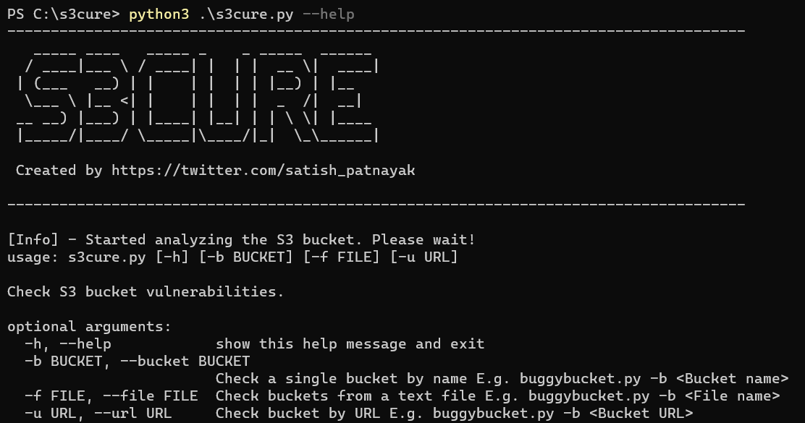
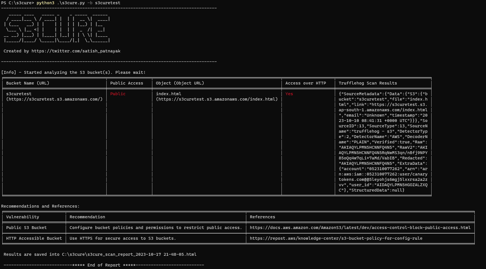
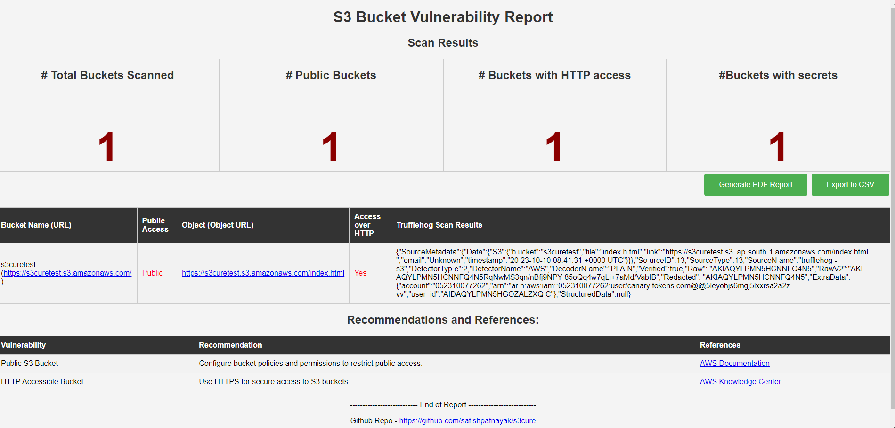

# s3cure

s3cure is a Python script designed to scan Amazon S3 buckets for potential security vulnerabilities. It checks for the following:

1. Public Access: Identifies if the S3 bucket is publicly accessible.
2. HTTP/HTTPS Access: Determines if the bucket can be accessed over HTTP or HTTPS.
3. Secrets: Searches for sensitive information or credentials stored within the bucket using Trufflehog.

## Prerequisites

- Python 3.x installed
- Trufflehog v3 (https://github.com/trufflesecurity/trufflehog#floppy_disk-installation) 
    - For MAC - ```brew install trufflesecurity/trufflehog/trufflehog``` </br>
    - For Windows - Download the .exe from https://github.com/trufflesecurity/trufflehog/releases and add the path to Environment variable </br>
    - For Linux - 
    ```curl -sSfL https://raw.githubusercontent.com/trufflesecurity/trufflehog/main/scripts/install.sh | sh -s -- -b /usr/local/bin ```

## Installation

```bash
git clone https://github.com/your_username/s3cure.git
cd s3cure
pip3 install -r requirements.txt
```
## Usgae
```
python3 s3cure.py --help 
python3 s3cure.py -b <S3 bucket name> 
python3 s3cure.py -f <file name with list of S3 bucket names> 
python3 s3cure.py -u <S3 bucket URL> 
```

</br></br>

</br></br>


## Output
The script will provide a detailed report, in terminal and html doc,  indicating the status of the specified S3 bucket with respect to public access, HTTP/HTTPS access, and the presence of any potential secrets.

## Export 
Export the results to CSV and PDF from HTML file.

## Contributing
Contributions are welcome! Please open an issue or submit a pull request.

## Disclaimer
This script is provided for educational and security assessment purposes only. Use it at your own risk and only on systems that you have explicit permission to scan. The author is not responsible for any unauthorized or illegal use of this script.

## Author
Name: Satish Patnayak </br>
X (Twitter): <a href="https://twitter.com/satish_patnayak">@satish_patnayak</a>
